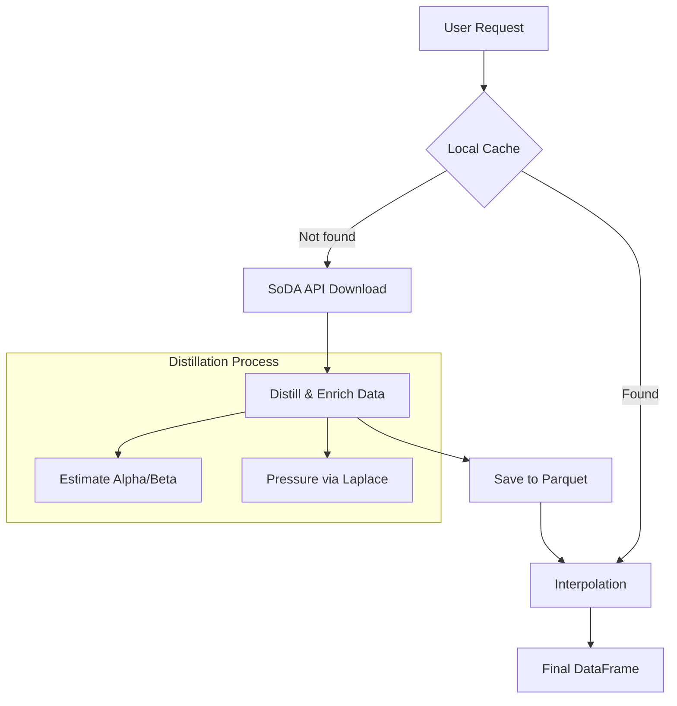

# Pysparta ☀️

**pysparta** is a high-performance Python library designed for advanced clear-sky solar radiation modeling. It provides a seamless bridge between complex atmospheric datasets (like MERRA-2 and CAMS) and state-of-the-art radiative transfer parameterizations.

## Why Pysparta?

Researchers and engineers often spend 80% of their time retrieving, cleaning, and interpolating atmospheric data before they can run a single simulation. **Pysparta flips this ratio.**

### Key Pillars:
*   **Integrated Data Pipeline**: Automatically fetches and caches atmospheric parameters (AOD, water vapor, ozone) from SoDA-Pro and MERRA-2.
*   **Scientific Rigor**: Implements the **SPARTA** model, a modern 2-band parameterization published in *Solar Energy* (2025), alongside classic standards like the **Bird** model.
*   **Optimized Performance**: Built on top of `numpy`, `xarray`, and `blosc2` for lightning-fast vectorized calculations and efficient data storage.
*   **Professional Tooling**: Developed with modern Python standards, including fuzzy type validation, detailed logging, and a fully documented API.

## At a Glance

Whether you need to evaluate clear-sky solar irradiance at a single location or generate a continental irradiance map, Pysparta scales with your needs:

```python
import pysparta

# From coordinates to irradiance in one step
results = pysparta.sites(
    times_utc=pd.date_range("2023-06-21", periods=24, freq="h"),
    latitude=40.4, longitude=-3.7,
    atmos="merra2_lta"
)
```

---
!!! quote "Scientific Heritage"
    "pysparta aims to make high-fidelity radiative transfer modeling accessible, fast, and reproducible for the entire solar energy community."

## How it works

Pysparta handles the heavy lifting of data synchronization and physical modeling:



## Main Features

*   **Smart Caching**: Minimizes API calls by storing yearly data in optimized `.parquet` files.
*   **Physical Consistency**: Estimates missing parameters like barometric pressure and Angström exponents using validated scientific formulas.
*   **Fuzzy Validation**: Input coordinates and parameters are validated with fuzzy matching to prevent common typos.
*   **Seamless Integration**: Designed to work directly with `pandas` and `sparta`.

---

!!! tip
Don't forget to set your email before starting:
`pysparta.set_option("soda_user_email", "your@email.com")`

